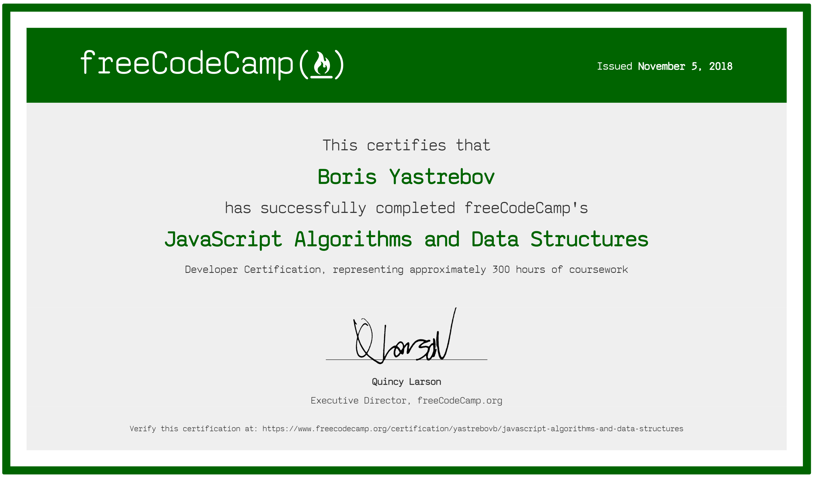

## JavaScript Algorithms and Data Structures 

&nbsp;

- Basic JavaScript
- ES6
- Regular Expressions
- Debugging 
- Basic Data Structures
- Basic Algorithm Scripting challenges [show solutions](https://github.com/yastrebovb/js-algorithms-and-data-structures/tree/master/src/Basic%20Algorithm%20Scripting)
- Object Oriented Programming 
- Functional Programming 
- Intermediate Algorithm Scripting challenges [show solutions](https://github.com/yastrebovb/js-algorithms-and-data-structures/tree/master/src/Intermediate%20Algorithm%20Scripting)
- JavaScript Algorithms and Data Structures projects [show solutions](https://github.com/yastrebovb/js-algorithms-and-data-structures/tree/master/src/Projects)

&nbsp;

##### [visit freeCodeCamp curriculum](https://learn.freecodecamp.org/)
